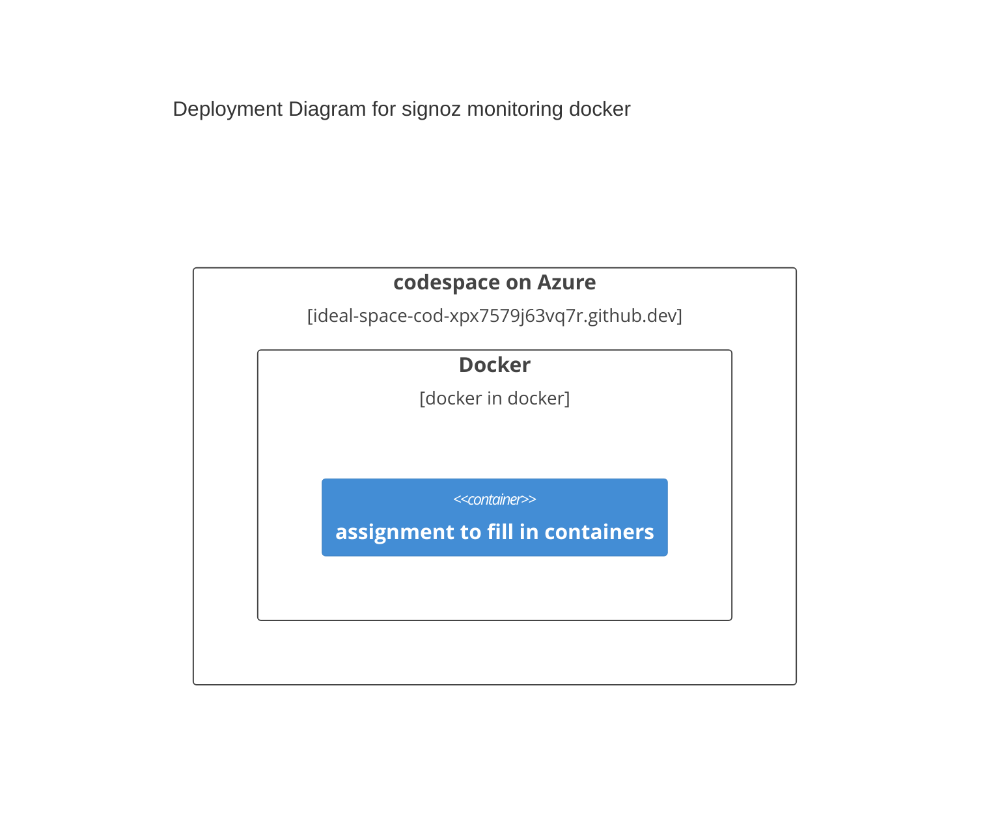

# cdevops-info8985-task1
consume cdevops-signoz as a sub module describe with mermaid and README.md

Supports *course learning outcome*:

Select and implement tools to log from micro-front end UI to micro-services to meet operational requirements (PLO8)

### Points to Cover

## Marking

|Item|Out Of|
|--|--:|
|use [this article](https://www.ganesshkumar.com/articles/2025-01-07-git-submodules-cheat-sheet/) to consume [cdevops-signoz](https://github.com/conestogac-acsit/cdevops-signoz) as a submodule|2|
|update this README to give the steps you used to make it work in a codespace|2|
|include a screenshot of signoz logs in this README|2|
|include a screenshot of the infrastructure in this README|2|
|update the above mermaid deployment diagram to include the containers you created with cdevops-signoz docker compose|1|
|write a paragraph detailing the role that each container plays in the deployment|1|
|||
|total|10|

## Submission

Submit a .zip downloaded from your github. In the comments include a link to your github.
